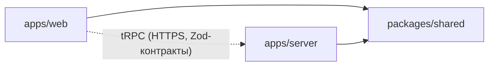
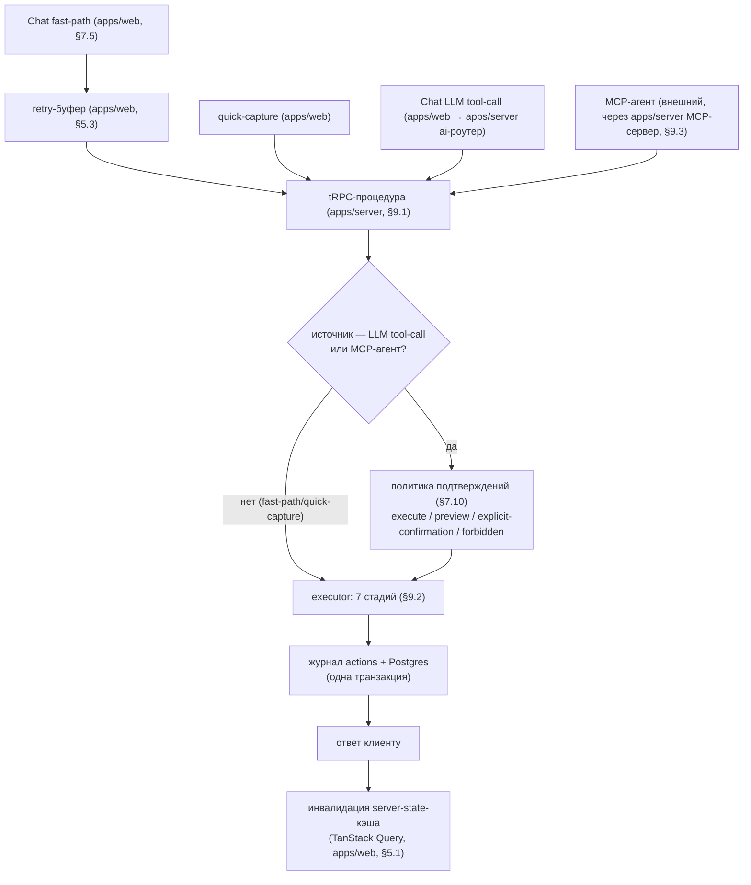
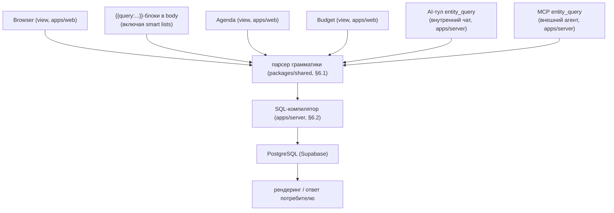
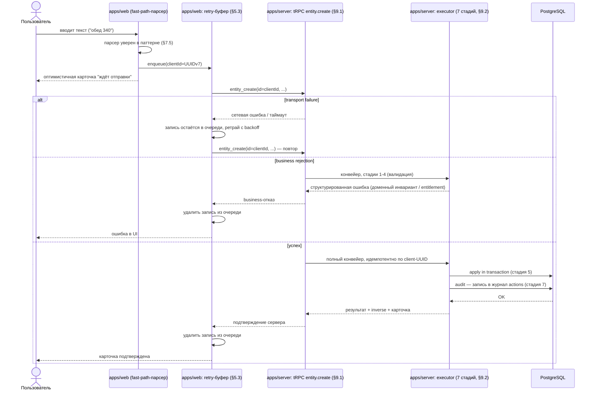
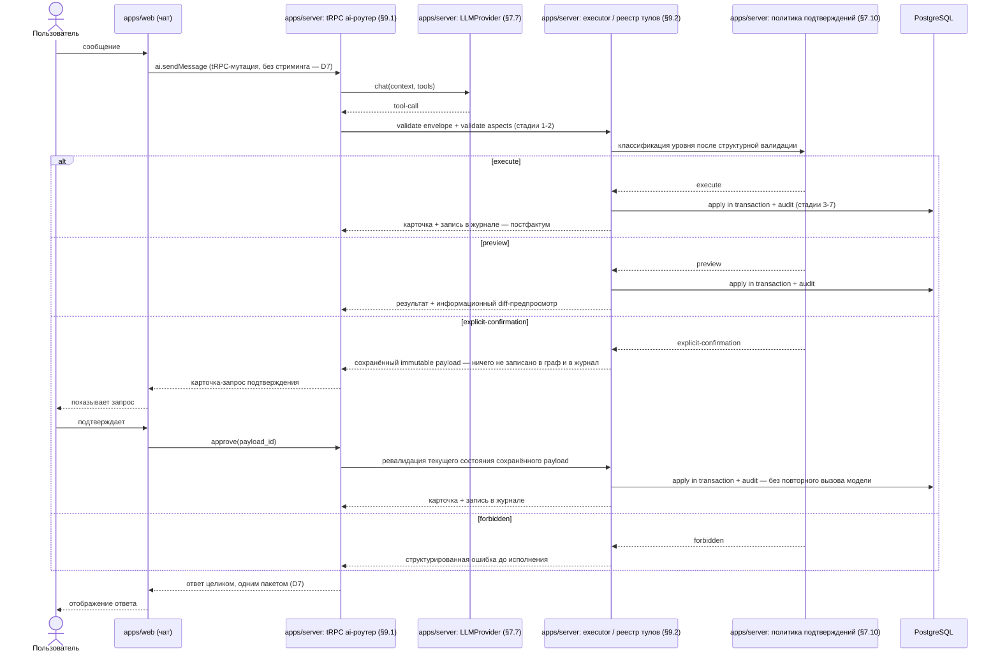
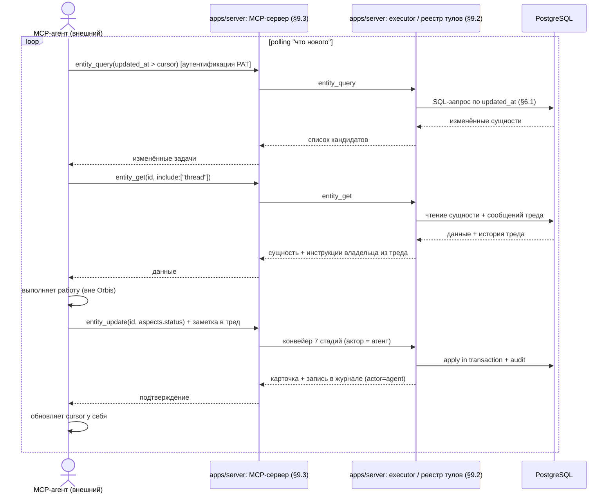
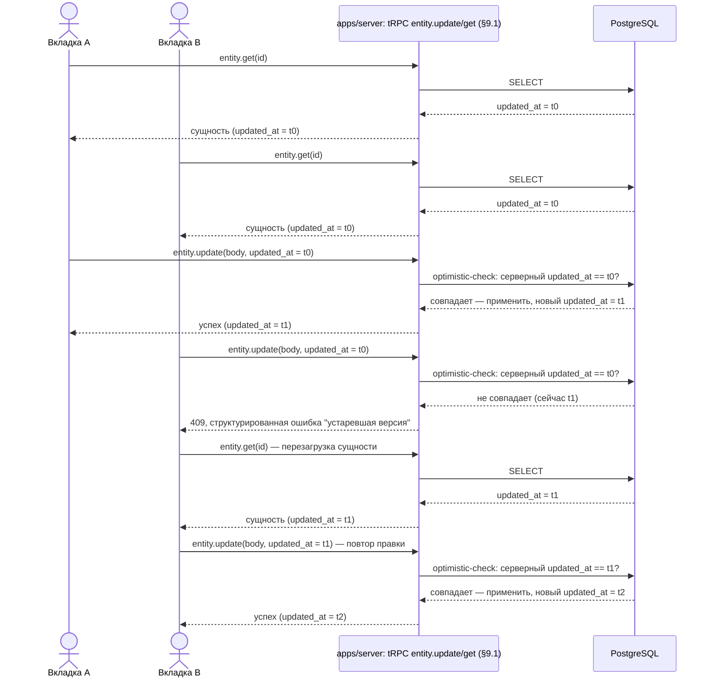
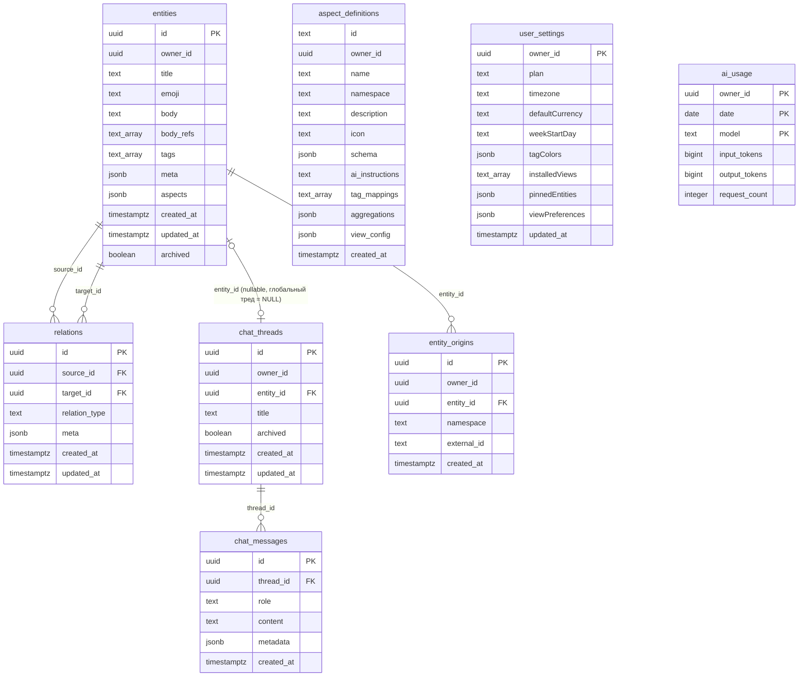

# Orbis Implementation v3.1 — 00: Архитектура

| Поле | Значение |
|---|---|
| Версия | 3.1 |
| Дата | 2026-07-02 |
| Класс документа | Implementation-архитектура — обновляется при изменении контрактов PRD, а не при рефакторинге кода |
| Источник контрактов | `docs/prd/` (00–04), прежде всего `01-architecture.md` |

Этот документ показывает **структуру реализации** v3.1: карту модулей монорепо, правила направления зависимостей, потоки мутаций и чтения, ключевые sequence-диаграммы и ER-схему восьми таблиц. Он не дублирует PRD — каждая диаграмма цитирует конкретную секцию `docs/prd/01-architecture.md` как источник контракта и не вводит механизмов, которых там нет. Если деталь реализации не зафиксирована в PRD (например, конкретный формат ключа клиентского кэша), она здесь остаётся на уровне роли, а не выдуманной специфики.

Границу детализации см. в §6.

---

## §1. Карта модулей монорепо

Три workspace-пакета Bun-монорепо:

```
apps/web        — PWA (React): экраны (Browser, Budget, Agenda, чат),
                  переиспользуемый чат-компонент (используется и для
                  глобального треда, и для треда сущности, PRD 01 §7.3),
                  клиентский fast-path-парсер (PRD 01 §7.5, детерминированный,
                  без LLM, работает офлайн), retry-буфер неотправленных
                  fast-path-create мутаций (PRD 01 §5.3), TanStack Query
                  (server-state-кэш, PRD 01 §5.1) + Zustand (UI state),
                  tRPC-клиент

apps/server     — Hono + @hono/trpc-server: tRPC-роутеры entity/relation/
                  aspect/user/ai/chat (PRD 01 §9.1), executor — семистадийный
                  конвейер мутаций (PRD 01 §9.2), политика подтверждений
                  (PRD 01 §7.10), LLM-оркестрация за интерфейсом LLMProvider
                  поверх Vercel AI SDK (PRD 01 §7.7), MCP-сервер — тонкий
                  адаптер над тем же tool-executor'ом (PRD 01 §9.3),
                  SQL-компилятор query-движка (PRD 01 §6.2), entitlements-
                  резолвер (PRD 01 §8), экспорт (PRD 01 §9.4)

packages/shared — Zod-схемы wire-контрактов (вход/выход tRPC-процедур,
                  общие типы клиента и сервера, PRD 01 §9.1), AST-типы
                  грамматики query-движка (PRD 01 §6.1, используются парсером
                  и SQL-компилятором), константы (aspect id, relation types,
                  namespaces), типы реестра аспектов
```

**Примечание о размещении fast-path-парсера.** PRD 01 §7.5 называет его буквально «клиентским парсером» и требует офлайн-работы без сети — это возможно только при выполнении в `apps/web`. `apps/server` не содержит второй копии текстового парсера: он получает от клиента уже структурированный `entity_create` (через retry-буфер или напрямую) и валидирует его тем же executor-конвейером, что и любую другую мутацию (§2). `packages/shared` не хранит правил распознавания fast-path-паттернов — только контракты (Zod-схемы) полезной нагрузки, которую парсер формирует.

### §1.1 Правила направления зависимостей

Адаптировано из архивной карты `docs/implementation_old/01-application-architecture.md` под v3.1: убраны пакеты `client-db`/`server-db`/`sync` (собственной БД у клиента нет, синхронизации нет — PRD 01 §4.12, §5.1), добавлен retry-буфер как единственное персистентное клиентское состояние.



1. `apps/*` зависят от `packages/shared`; обратной зависимости нет. `apps/web` и `apps/server` не импортируют друг друга напрямую — единственная связь между ними сетевая (tRPC), не через общий код.
2. `packages/shared` не импортирует React, Hono, Drizzle, Supabase, tRPC-сервер или AI SDK — это чистый слой контрактов и типов.
3. Типы Vercel AI SDK не выходят за пределы модуля LLMProvider внутри `apps/server` (PRD 01 §7.7): наружу — в tRPC-роутеры, в журнал действий, в MCP-адаптер — отдаются только собственные типы Orbis.
4. Клиент не знает о Drizzle или о Supabase Data API и не имеет собственной базы данных (PRD 01 §4.12): все чтения и мутации идут только через tRPC → executor — «один путь мутаций» (PRD 01 §9.1). Supabase на клиенте используется исключительно для Auth (получение JWT).
5. UI-компоненты `apps/web` не конструируют SQL и не содержат доменных правил — они вызывают tRPC-процедуры и рендерят их результат. Вся валидация инвариантов живёт в executor'е `apps/server` (7 стадий, §9.2), а не в роутерах и не в UI.
6. Единственное персистентное клиентское состояние — retry-буфер неотправленных fast-path-create мутаций (PRD 01 §5.3, §4.12): очередь ещё не подтверждённых сервером запросов, не серверная модель данных и не её слепок.
7. MCP-сервер — тонкий адаптер поверх того же реестра тулов и того же tool-executor'а, что и внутренний AI-чат (PRD 01 §9.3): он не содержит собственной бизнес-логики и не может дать внешнему агенту более широкие права, чем внутреннему AI.
8. tRPC-роутеры и MCP-адаптер не реализуют бизнес-правила сами — они транслируют вход во входной формат executor'а и возвращают его результат.

---

## §2. Поток мутаций

Источники мутаций, конвейер executor'а и точка инвалидации клиентского кэша — по PRD 01 §5.3, §7.10, §9.1–§9.2.



Пояснения к диаграмме:

- **Retry-буфер** стоит на стороне `apps/web` перед tRPC и участвует только в пути fast-path-create (Chat fast-path, §7.5) — офлайн-правки существующих сущностей и LLM-путь через него не идут (PRD 01 §5.3, §7.9). Quick-capture (PRD 02 §3.7) в буфер не заходит: это отдельный не-чатовый путь без AI и без fast-path-грамматики, идущий в tRPC напрямую — контракт буфера (PRD 01 §5.3) охватывает только fast-path-create.
- **Ветвление по политике подтверждений** относится только к путям LLM tool-call и MCP-агента; fast-path/quick-capture — прямая, детерминированная команда пользователя, политика §7.10 к ней не применяется. На диаграмме это показано на уровне потока; внутри самого семистадийного конвейера (§9.2) классификация уровня фактически происходит после стадий 1–2 (структурная валидация) и до стадии 5 (apply) — здесь показан только факт наличия этой проверки для LLM/MCP-путей.
- **Executor 7 стадий** (§9.2): validate envelope → validate aspects → load state → validate all before first write → apply in transaction → inverse ops + cards → audit. Все семь стадий выполняются в `apps/server`, вне зависимости от источника мутации.
- **Журнал actions + Postgres — одна транзакция**: карточка чата и запись в `chat_messages.metadata.actions` появляются только после успешного `apply` (§7.8).
- **Инвалидация server-state-кэша** — заключительный шаг на клиенте: TanStack Query перечитывает данные с сервера после успешной мутации (§5.1); сервер не хранит и не обязан знать состояние клиентского кэша.

---

## §3. Поток чтения

Единая грамматика (PRD 01 §6.1), один SQL-бэкенд (Postgres, §6.2) и шесть потребителей (§6.3).



Шесть потребителей на диаграмме — конкретизация строк PRD 01 §6.3 до уровня диаграммы: строка «Фильтры views» раскрыта в три отдельных узла (Browser / Budget / Agenda — три разных view с собственным UI-состоянием фильтра); строка «AI-тул `entity_query`» раскрыта в два узла по транспорту вызова (внутренний чат и MCP — оба вызывают один и тот же тул `entity_query` из единого реестра, §9.2, но входят в систему разными путями); Smart lists не показаны отдельным узлом — по PRD 01 §1.3 это сущности с query-блоками в body, то есть тот же механизм, что узел «`{{query:...}}`-блоки в body». Будущие потребители (прогресс целей, авто-чекины привычек, §11) на диаграмме MVP не показаны — они вне текущего слайсового скоупа, но используют тот же единственный парсер и компилятор без изменения ядра.

Все шесть потребителей компилируют запрос в один и тот же SQL и исполняют его на одном бэкенде — отдельного клиентского движка нет (§6.3): даже когда query-блок отображается в `apps/web`, сам запрос выполняется на сервере через tRPC.

---

## §4. Sequence-диаграммы ключевых флоу

Участники диаграмм — модули из §1: `apps/web` (и его внутренние роли — retry-буфер, чат-UI), `apps/server` (и его внутренние роли — tRPC, executor, LLMProvider, политика подтверждений, MCP-сервер), PostgreSQL. Имена tRPC-процедур на диаграммах (`ai.sendMessage`, `entity.get` и т.п.) иллюстративны; контракт сигнатур процедур в PRD не фиксируется и живёт в коде (PRD 01 §9.1).

### §4.1 Fast-path + retry-буфер

Контракт: PRD 01 §5.3 (retry-буфер), §7.5 (fast-path-парсер).



Три обязательные ветки присутствуют: transport failure (остаётся в очереди, ретрай с backoff), business rejection (удаление из очереди + ошибка в UI), успех (executor идемпотентен по client-UUID → журнал → подтверждение → удаление из очереди).

### §4.2 Tool-call + политика подтверждений

Контракт: PRD 01 §7.10 (политика подтверждений, решение D6), §7.7 (транспорт чата — обычная мутация, ответ целиком, решение D7).



Четыре ветки уровня присутствуют (execute / preview / explicit-confirmation / forbidden); ветка `explicit-confirmation` показывает сохранённый immutable payload → одобрение пользователя → ревалидацию состояния → исполнение без повторного вызова модели, как того требует §7.10. Ответ — целиком, одним пакетом, без стриминга (D7).

### §4.3 MCP-polling «что нового»

Контракт: PRD 01 §9.3 (второй эталонный сценарий MCP-агента).



Обязательные элементы присутствуют: `entity_query(updated_at > cursor)` с PAT-аутентификацией, изменённые задачи, `entity_get(include:["thread"])`, инструкции владельца из треда, `entity_update(status)` + заметка в тред, прохождение через executor и запись в журнал с актором-агентом; курсор хранится у самого агента, не на сервере Orbis (§9.3).

### §4.4 Optimistic-check body

Контракт: PRD 01 §5.2 (конкурентность, optimistic-check по `updated_at`).



Обязательная последовательность присутствует: обе вкладки читают `updated_at = t0`, первая правит успешно (`t1`), вторая получает 409 «устаревшая версия», перезагружает сущность и повторяет правку успешно.

---

## §5. ER-схема

Восемь таблиц — состав и колонки скопированы из PRD 01 §4 (Task 1) без добавлений и без пропусков; версионных или репликационных служебных полей на сущностях нет, владение — `owner_id` (PRD 01 §4.10).



Примечания к схеме:

- `aspect_definitions.id` не является surrogate PK: уникальность обеспечивают два partial unique index — `UNIQUE (id) WHERE owner_id IS NULL` для встроенных аспектов и `UNIQUE (owner_id, id)` для кастомных (PRD 01 §4.3). На диаграмме `id` намеренно не помечен `PK`.
- `ai_usage` — составной первичный ключ `(owner_id, date, model)`, без собственного суррогатного `id` (PRD 01 §4.7).
- `chat_threads.entity_id` — nullable: `NULL` означает глобальный тред пользователя (мессенджер-модель), не связанный ни с одной сущностью; связь `entities |o--o| chat_threads` на диаграмме относится только к тредам сущностей — не более одного треда на сущность (PRD 01 §4.5).
- Типы `text_array` на диаграмме соответствуют Postgres `text[]` (ограничение синтаксиса Mermaid ER на символы в имени типа); `date`, `jsonb`, `bigint`, `boolean`, `timestamptz` — типы колонок как в PRD 01 §4.
- Владение — `owner_id` на каждой таблице, где оно применимо (кроме `relations` и `chat_messages`, чьё владение резолвится транзитивно через связанные `entities`/`chat_threads` — RLS-политика PRD 01 §4.10).

---

## §6. Граница детализации

Этот документ фиксирует структуру: какие модули существуют, кто кого вызывает, где живёт каждый контракт PRD. Детализация до уровня классов, функций, сигнатур tRPC-процедур и конкретных файлов — задача implementation-плана каждого слайса, пишется just-in-time непосредственно перед стартом слайса (по образцу `docs/superpowers/plans/`), а не этого документа. Документ обновляется, когда меняется контракт PRD — состав таблиц (§4), поведение персистентности и конкурентности (§5), грамматика query-движка (§6), конвейер executor'а или реестр тулов (§9.2), политика подтверждений (§7.10) и т.п., — а не при рефакторинге кода, не меняющем наблюдаемое поведение системы. Если реализация слайса вскрывает несоответствие между этой картой и кодом при неизменном PRD, правится код, а не эта карта.
