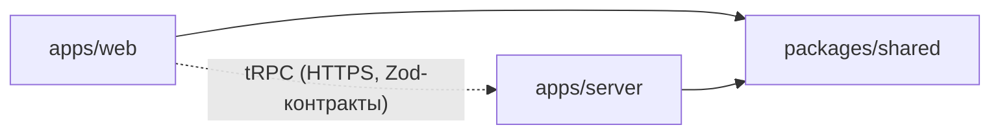
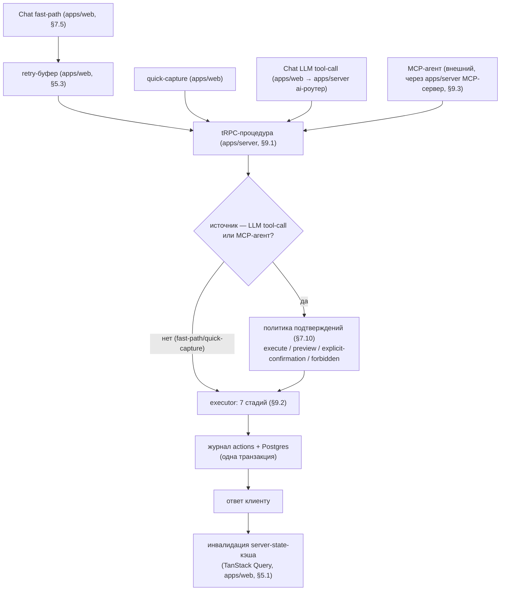
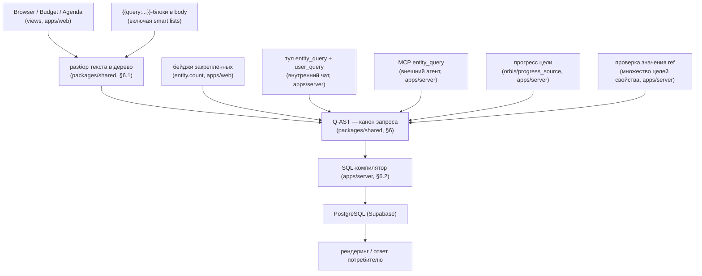
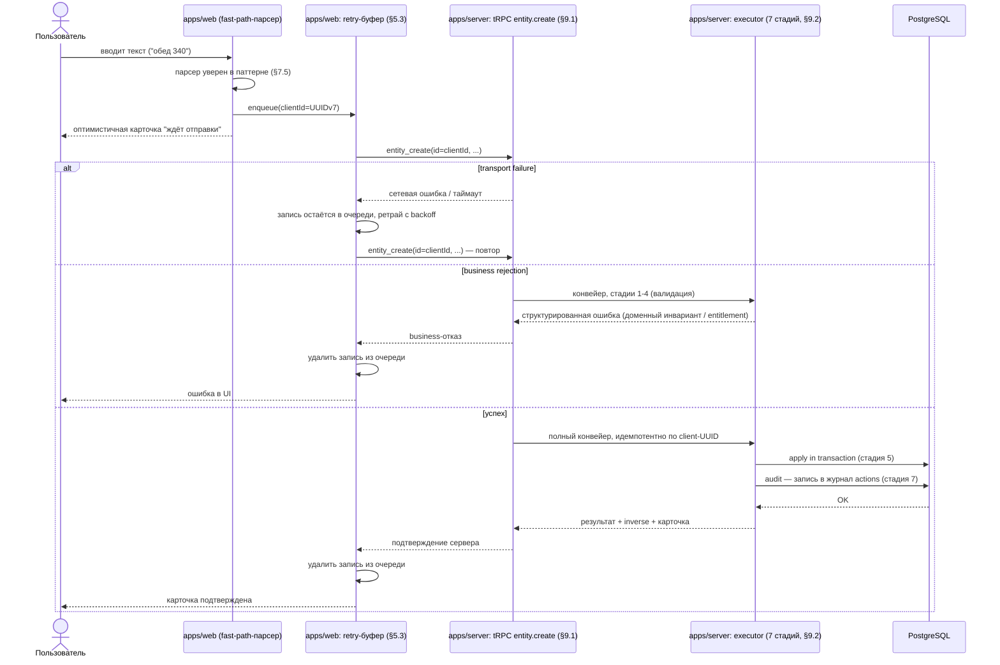
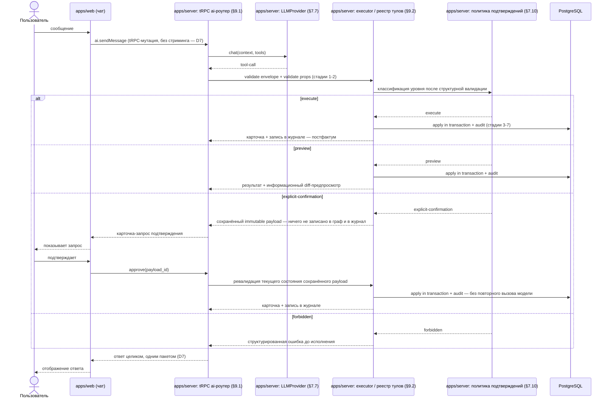
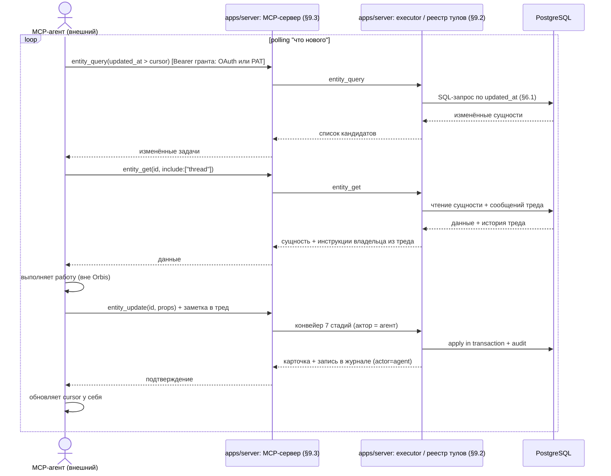
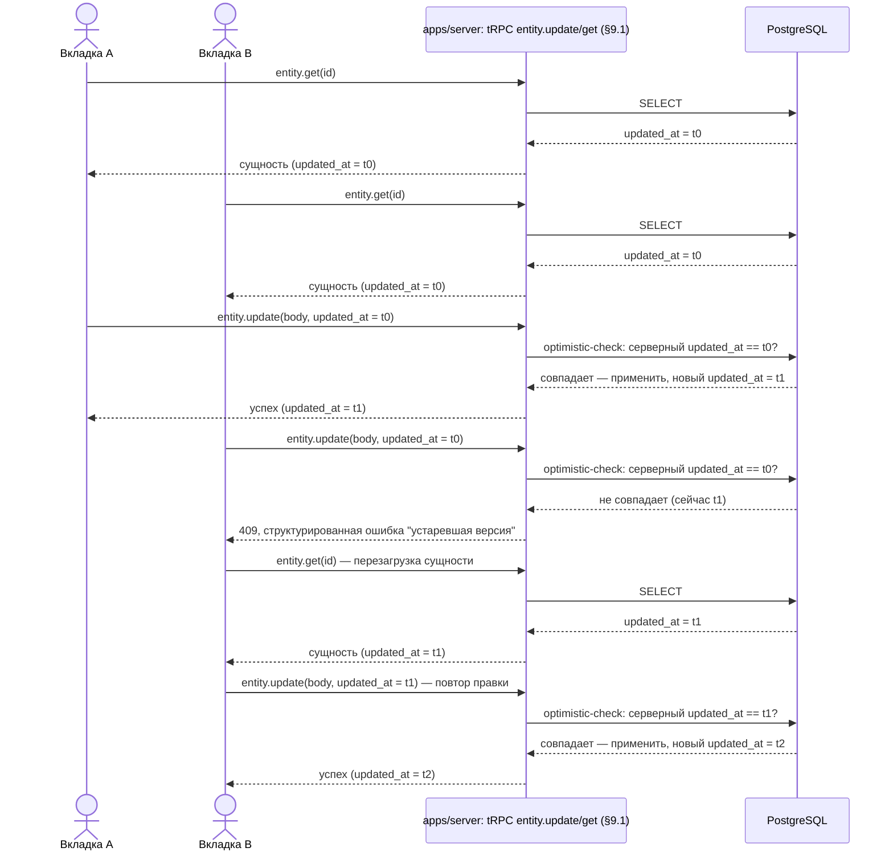

# Orbis Implementation v3.1 — 00: Архитектура

| Поле | Значение |
|---|---|
| Версия | 3.1 |
| Дата | 2026-07-02 |
| Класс документа | Implementation-архитектура — обновляется при изменении контрактов PRD, а не при рефакторинге кода |
| Источник контрактов | `docs/prd/` (00–04), прежде всего `01-architecture.md` |

Этот документ показывает **структуру реализации** v3.1: карту модулей монорепо, правила направления зависимостей, потоки мутаций и чтения, ключевые sequence-диаграммы и ER-схему восемнадцати таблиц. Он не дублирует PRD — каждая диаграмма цитирует конкретную секцию `docs/prd/01-architecture.md` как источник контракта и не вводит механизмов, которых там нет. Если деталь реализации не зафиксирована в PRD (например, конкретный формат ключа клиентского кэша), она здесь остаётся на уровне роли, а не выдуманной специфики.

Границу детализации см. в §6.

---

## §1. Карта модулей монорепо

Три workspace-пакета Bun-монорепо:

```
apps/web        — PWA (React): экраны (Browser, Budget, Agenda, чат),
                  переиспользуемый чат-компонент (используется и для
                  глобального треда, и для треда сущности, PRD 01 §7.3),
                  клиентский fast-path-парсер (PRD 01 §7.5, детерминированный,
                  без LLM, работает офлайн), retry-буфер неотправленных
                  fast-path-create мутаций (PRD 01 §5.3), экран согласия
                  OAuth и раздел «Агенты» в настройках (PRD 01 §9.3,
                  02-core-os §1.6), TanStack Query
                  (server-state-кэш, PRD 01 §5.1) + Zustand (UI state),
                  tRPC-клиент

apps/server     — Hono + @hono/trpc-server: tRPC-роутеры entity/relation/
                  aspect/user/ai/chat/agentRun/version/routine (PRD 01 §9.1),
                  agent-loop — круг исполнителя (глаголы, очередь,
                  подметание брошенных прогонов, откат прогона;
                  PRD 01 §9.3, D37), routines — рутины и внутренний
                  исполнитель (планировщик, раннер, предложение;
                  PRD 01 §3.16, §9.3, D38), executor — семистадийный
                  конвейер мутаций (PRD 01 §9.2), политика подтверждений
                  (PRD 01 §7.10), LLM-оркестрация за интерфейсом LLMProvider
                  поверх Vercel AI SDK (PRD 01 §7.7), MCP-сервер — тонкий
                  адаптер над тем же tool-executor'ом (PRD 01 §9.3),
                  authorization server OAuth 2.1 для входа внешних агентов
                  (PRD 01 §9.3, D34): метаданные ресурса и AS, динамическая
                  регистрация клиентов, обмен кода и ротация refresh, выдача
                  и отзыв грантов; экран согласия своего роута НЕ имеет —
                  это страница `apps/web` (примечание ниже),
                  SQL-компилятор query-движка (PRD 01 §6.2), registry —
                  эффективный реестр владельца (система ⊕ дельты), его кеш по
                  версии, операции над свойствами и граф зависимостей
                  деклараций (PRD 01 §4.16) [D43], entitlements-резолвер
                  (PRD 01 §8), экспорт (PRD 01 §9.4)

packages/shared — Zod-схемы wire-контрактов (вход/выход tRPC-процедур,
                  общие типы клиента и сервера, PRD 01 §9.1), канон запроса —
                  типы Q-AST, разбор текста в дерево и печать дерева в текст
                  (PRD 01 §6, используются формой query-блока, сидами и
                  SQL-компилятором), документ тела и его ноды (PRD 01 §4.1),
                  константы (id аспектов, ролей рёбер, namespaces), схемы
                  деклараций реестров — свойства, аспекты, роли рёбер
                  (PRD 01 §4.16) [D43]
```

**Примечание о размещении fast-path-парсера.** PRD 01 §7.5 называет его буквально «клиентским парсером» и требует офлайн-работы без сети — это возможно только при выполнении в `apps/web`. `apps/server` не содержит второй копии текстового парсера: он получает от клиента уже структурированный `entity_create` (через retry-буфер или напрямую) и валидирует его тем же executor-конвейером, что и любую другую мутацию (§2). `packages/shared` не хранит правил распознавания fast-path-паттернов — только контракты (Zod-схемы) полезной нагрузки, которую парсер формирует.

**Примечание о размещении экрана согласия OAuth.** Authorization server живёт в `apps/server`, но страница, на которой владелец жмёт «Разрешить», — в `apps/web`, и серверного роута под `GET /oauth/authorize` нет вовсе: запрос доходит до SPA-fallback, страницу распознаёт клиент. Причина не в удобстве: сессию владельца держит веб-клиент (Supabase-токен в `localStorage`), и серверный HTML её не увидел бы — ему понадобилась бы собственная кука и второй способ логина. Сама выдача кода при этом остаётся серверной (tRPC-процедуры согласия), то есть граница «UI решает, сервер выдаёт» не размывается. Путь страницы записан один раз в `packages/shared` и читается обеими сторонами — метаданные AS и SPA обязаны называть один адрес.

### §1.1 Правила направления зависимостей

Адаптировано из архивной карты `docs/implementation_old/01-application-architecture.md` под v3.1: убраны пакеты `client-db`/`server-db`/`sync` (собственной БД у клиента нет, синхронизации нет — PRD 01 §4.12, §5.1), добавлен retry-буфер как единственное персистентное клиентское состояние.


```mermaid
flowchart LR
    Web["apps/web"] --> Shared["packages/shared"]
    Server["apps/server"] --> Shared
    Web -. "tRPC (HTTPS, Zod-контракты)" .-> Server
```

1. `apps/*` зависят от `packages/shared`; обратной зависимости нет. `apps/web` и `apps/server` не импортируют друг друга напрямую — единственная связь между ними сетевая (tRPC), не через общий код.
2. `packages/shared` не импортирует React, Hono, Drizzle, Supabase, tRPC-сервер или AI SDK — это чистый слой контрактов и типов.
3. Типы Vercel AI SDK не выходят за пределы модуля LLMProvider внутри `apps/server` (PRD 01 §7.7): наружу — в tRPC-роутеры, в журнал действий, в MCP-адаптер — отдаются только собственные типы Orbis.
4. Клиент не знает о Drizzle или о Supabase Data API и не имеет собственной базы данных (PRD 01 §4.12): все чтения и мутации идут только через tRPC → executor — «один путь мутаций» (PRD 01 §9.1). Supabase на клиенте используется исключительно для Auth (получение JWT).
5. UI-компоненты `apps/web` не конструируют SQL и не содержат доменных правил — они вызывают tRPC-процедуры и рендерят их результат. Вся валидация инвариантов живёт в executor'е `apps/server` (7 стадий, §9.2), а не в роутерах и не в UI.
6. Единственное персистентное клиентское состояние — retry-буфер неотправленных fast-path-create мутаций (PRD 01 §5.3, §4.12): очередь ещё не подтверждённых сервером запросов, не серверная модель данных и не её слепок.
7. MCP-сервер — тонкий адаптер поверх того же реестра тулов и того же tool-executor'а, что и внутренний AI-чат (PRD 01 §9.3): он не содержит собственной бизнес-логики и не может дать внешнему агенту более широкие права, чем внутреннему AI.
8. tRPC-роутеры и MCP-адаптер не реализуют бизнес-правила сами — они транслируют вход во входной формат executor'а и возвращают его результат.

---

## §2. Поток мутаций

Источники мутаций, конвейер executor'а и точка инвалидации клиентского кэша — по PRD 01 §5.3, §7.10, §9.1–§9.2.


```mermaid
flowchart TD
    ChatFastPath["Chat fast-path (apps/web, §7.5)"]
    QuickCapture["quick-capture (apps/web)"]
    ChatToolCall["Chat LLM tool-call (apps/web → apps/server ai-роутер)"]
    MCPAgent["MCP-агент (внешний, через apps/server MCP-сервер, §9.3)"]

    Buffer["retry-буфер (apps/web, §5.3)"]

    ChatFastPath --> Buffer
    Buffer --> TRPC["tRPC-процедура (apps/server, §9.1)"]
    QuickCapture --> TRPC
    ChatToolCall --> TRPC
    MCPAgent --> TRPC

    TRPC --> IsToolCall{"источник — LLM tool-call\nили MCP-агент?"}
    IsToolCall -- "да" --> ConfirmPolicy["политика подтверждений (§7.10)\nexecute / preview / explicit-confirmation / forbidden"]
    IsToolCall -- "нет (fast-path/quick-capture)" --> Executor
    ConfirmPolicy --> Executor["executor: 7 стадий (§9.2)"]

    Executor --> TxWrite["журнал actions + Postgres\n(одна транзакция)"]
    TxWrite --> Response["ответ клиенту"]
    Response --> CacheInvalidate["инвалидация server-state-кэша\n(TanStack Query, apps/web, §5.1)"]
```

Пояснения к диаграмме:

- **Retry-буфер** стоит на стороне `apps/web` перед tRPC и участвует только в пути fast-path-create (Chat fast-path, §7.5) — офлайн-правки существующих сущностей и LLM-путь через него не идут (PRD 01 §5.3, §7.9). Quick-capture (PRD 02 §3.7) в буфер не заходит: это отдельный не-чатовый путь без AI и без fast-path-грамматики, идущий в tRPC напрямую — контракт буфера (PRD 01 §5.3) охватывает только fast-path-create.
- **Ветвление по политике подтверждений** относится только к путям LLM tool-call и MCP-агента; fast-path/quick-capture — прямая, детерминированная команда пользователя, политика §7.10 к ней не применяется. На диаграмме это показано на уровне потока; внутри самого семистадийного конвейера (§9.2) классификация уровня фактически происходит после стадий 1–2 (структурная валидация) и до стадии 5 (apply) — здесь показан только факт наличия этой проверки для LLM/MCP-путей.
- **Executor 7 стадий** (§9.2): validate envelope → validate props → load state → validate all before first write → apply in transaction → inverse ops + cards → audit. Вторая стадия проверяет значения по **типам свойств из реестра** (PRD 01 §4.16), а не по схемам из кода [D43]; число и порядок стадий реформа не меняет. Все семь стадий выполняются в `apps/server`, вне зависимости от источника мутации.
- **Журнал actions + Postgres — одна транзакция**: карточка чата и запись в `chat_messages.metadata.actions` появляются только после успешного `apply` (§7.8).
- **Инвалидация server-state-кэша** — заключительный шаг на клиенте: TanStack Query перечитывает данные с сервера после успешной мутации (§5.1); сервер не хранит и не обязан знать состояние клиентского кэша.

---

## §3. Поток чтения

Единый канон — булево дерево `and/or/not` (PRD 01 §6), один SQL-бэкенд (Postgres, §6.2) и **семь точек вызова компилятора в четырёх модулях** (§6.3) [D43].


```mermaid
flowchart TD
    Browser["Browser / Budget / Agenda\n(views, apps/web)"]
    BodyQuery["{{query:...}}-блоки в body\n(включая smart lists)"]
    Badges["бейджи закреплённых\n(entity.count, apps/web)"]
    AIEntityQuery["тул entity_query + user_query\n(внутренний чат, apps/server)"]
    MCPEntityQuery["MCP entity_query\n(внешний агент, apps/server)"]
    Goals["прогресс цели\n(orbis/progress_source, apps/server)"]
    RefCheck["проверка значения ref\n(множество целей свойства, apps/server)"]

    Browser --> Text
    BodyQuery --> Text
    Text["разбор текста в дерево\n(packages/shared, §6.1)"] --> Ast
    Badges --> Ast
    AIEntityQuery --> Ast
    MCPEntityQuery --> Ast
    Goals --> Ast
    RefCheck --> Ast

    Ast["Q-AST — канон запроса\n(packages/shared, §6)"] --> SQLCompiler["SQL-компилятор (apps/server, §6.2)"]
    SQLCompiler --> Postgres["PostgreSQL (Supabase)"]
    Postgres --> Render["рендеринг / ответ потребителю"]
```

**Что на диаграмме изменила реформа.** Во-первых, разбор текста перестал быть общим входом: канон — дерево, и половина точек вызова строит его без всякого текста (форма query-блока, прогресс цели, множество целей ссылочного свойства, AST-вход тула). Текстовый разбор остался входом там, где запрос **пишет человек**, и это узел «разбор текста в дерево», а не «парсер грамматики» на пути у всех.

Во-вторых, потребителей стало семь, и три из них на прежней диаграмме отсутствовали: **бейджи закреплённых сущностей** (`entity.count` — тот же вход, другой ответ), **агрегаты** `user_query` (сумма и счёт) и **проверка значения ссылочного свойства** — новая точка среза А: тип `ref` несёт множество целей запросом, и запись значения вне множества получает отказ с причиной (PRD 01 §4.16, §6.3). Прежний узел «Фильтры views» свёрнут обратно в один: Browser, Budget и Agenda ходят одной и той же процедурой, и разными их делает только состояние UI, а не путь в движок.

В-третьих, из перечня будущих потребителей убраны **авто-чекины привычек**: аспекта `orbis/habit` в системе нет, и потребителем он не был никогда. Будущие точки вызова, названные решением, но не реализованные, — **область показа свойства** (`scope`: значение хранится и читается графом зависимостей, в SQL не компилируется), **подписки поверхностей** и **правила каталога** — часть Б реформы (PRD 01 §6.3).

Все семь точек компилируют дерево в один и тот же SQL и исполняют его на одном бэкенде — отдельного клиентского движка нет (§6.3): даже когда query-блок отображается в `apps/web`, сам запрос выполняется на сервере через tRPC.

---

## §4. Sequence-диаграммы ключевых флоу

Участники диаграмм — модули из §1: `apps/web` (и его внутренние роли — retry-буфер, чат-UI), `apps/server` (и его внутренние роли — tRPC, executor, LLMProvider, политика подтверждений, MCP-сервер), PostgreSQL. Имена tRPC-процедур на диаграммах (`ai.sendMessage`, `entity.get` и т.п.) иллюстративны; контракт сигнатур процедур в PRD не фиксируется и живёт в коде (PRD 01 §9.1).

### §4.1 Fast-path + retry-буфер

Контракт: PRD 01 §5.3 (retry-буфер), §7.5 (fast-path-парсер).


```mermaid
sequenceDiagram
    actor User as Пользователь
    participant Web as apps/web (fast-path-парсер)
    participant Buffer as apps/web: retry-буфер (§5.3)
    participant TRPC as apps/server: tRPC entity.create (§9.1)
    participant Executor as apps/server: executor (7 стадий, §9.2)
    participant DB as PostgreSQL

    User->>Web: вводит текст ("обед 340")
    Web->>Web: парсер уверен в паттерне (§7.5)
    Web->>Buffer: enqueue(clientId=UUIDv7)
    Web-->>User: оптимистичная карточка "ждёт отправки"
    Buffer->>TRPC: entity_create(id=clientId, ...)

    alt transport failure
        TRPC-->>Buffer: сетевая ошибка / таймаут
        Buffer->>Buffer: запись остаётся в очереди, ретрай с backoff
        Buffer->>TRPC: entity_create(id=clientId, ...) — повтор
    else business rejection
        TRPC->>Executor: конвейер, стадии 1-4 (валидация)
        Executor-->>TRPC: структурированная ошибка (доменный инвариант / entitlement)
        TRPC-->>Buffer: business-отказ
        Buffer->>Buffer: удалить запись из очереди
        Buffer-->>User: ошибка в UI
    else успех
        TRPC->>Executor: полный конвейер, идемпотентно по client-UUID
        Executor->>DB: apply in transaction (стадия 5)
        Executor->>DB: audit — запись в журнал actions (стадия 7)
        DB-->>Executor: OK
        Executor-->>TRPC: результат + inverse + карточка
        TRPC-->>Buffer: подтверждение сервера
        Buffer->>Buffer: удалить запись из очереди
        Buffer-->>User: карточка подтверждена
    end
```

Три обязательные ветки присутствуют: transport failure (остаётся в очереди, ретрай с backoff), business rejection (удаление из очереди + ошибка в UI), успех (executor идемпотентен по client-UUID → журнал → подтверждение → удаление из очереди).

### §4.2 Tool-call + политика подтверждений

Контракт: PRD 01 §7.10 (политика подтверждений, решение D6), §7.7 (транспорт чата — обычная мутация, ответ целиком, решение D7).


```mermaid
sequenceDiagram
    actor User as Пользователь
    participant Web as apps/web (чат)
    participant TRPC as apps/server: tRPC ai-роутер (§9.1)
    participant LLM as apps/server: LLMProvider (§7.7)
    participant Executor as apps/server: executor / реестр тулов (§9.2)
    participant Policy as apps/server: политика подтверждений (§7.10)
    participant DB as PostgreSQL

    User->>Web: сообщение
    Web->>TRPC: ai.sendMessage (tRPC-мутация, без стриминга — D7)
    TRPC->>LLM: chat(context, tools)
    LLM-->>TRPC: tool-call
    TRPC->>Executor: validate envelope + validate props (стадии 1-2)
    Executor->>Policy: классификация уровня после структурной валидации

    alt execute
        Policy-->>Executor: execute
        Executor->>DB: apply in transaction + audit (стадии 3-7)
        Executor-->>TRPC: карточка + запись в журнале — постфактум
    else preview
        Policy-->>Executor: preview
        Executor->>DB: apply in transaction + audit
        Executor-->>TRPC: результат + информационный diff-предпросмотр
    else explicit-confirmation
        Policy-->>Executor: explicit-confirmation
        Executor-->>TRPC: сохранённый immutable payload — ничего не записано в граф и в журнал
        TRPC-->>Web: карточка-запрос подтверждения
        Web-->>User: показывает запрос
        User->>Web: подтверждает
        Web->>TRPC: approve(payload_id)
        TRPC->>Executor: ревалидация текущего состояния сохранённого payload
        Executor->>DB: apply in transaction + audit — без повторного вызова модели
        Executor-->>TRPC: карточка + запись в журнале
    else forbidden
        Policy-->>Executor: forbidden
        Executor-->>TRPC: структурированная ошибка до исполнения
    end

    TRPC-->>Web: ответ целиком, одним пакетом (D7)
    Web-->>User: отображение ответа
```

Четыре ветки уровня присутствуют (execute / preview / explicit-confirmation / forbidden); ветка `explicit-confirmation` показывает сохранённый immutable payload → одобрение пользователя → ревалидацию состояния → исполнение без повторного вызова модели, как того требует §7.10. Ответ — целиком, одним пакетом, без стриминга (D7).

### §4.3 MCP-polling «что нового»

Контракт: PRD 01 §9.3 (второй эталонный сценарий MCP-агента).


```mermaid
sequenceDiagram
    actor Agent as MCP-агент (внешний)
    participant MCP as apps/server: MCP-сервер (§9.3)
    participant Executor as apps/server: executor / реестр тулов (§9.2)
    participant DB as PostgreSQL

    loop polling "что нового"
        Agent->>MCP: entity_query(updated_at > cursor) [Bearer гранта: OAuth или PAT]
        MCP->>Executor: entity_query
        Executor->>DB: SQL-запрос по updated_at (§6.1)
        DB-->>Executor: изменённые сущности
        Executor-->>MCP: список кандидатов
        MCP-->>Agent: изменённые задачи

        Agent->>MCP: entity_get(id, include:["thread"])
        MCP->>Executor: entity_get
        Executor->>DB: чтение сущности + сообщений треда
        DB-->>Executor: данные + история треда
        Executor-->>MCP: сущность + инструкции владельца из треда
        MCP-->>Agent: данные

        Agent->>Agent: выполняет работу (вне Orbis)

        Agent->>MCP: entity_update(id, props) + заметка в тред
        MCP->>Executor: конвейер 7 стадий (актор = агент)
        Executor->>DB: apply in transaction + audit
        Executor-->>MCP: карточка + запись в журнале (actor=agent)
        MCP-->>Agent: подтверждение

        Agent->>Agent: обновляет cursor у себя
    end
```

Обязательные элементы присутствуют: `entity_query(updated_at > cursor)` с аутентификацией по Bearer-токену гранта (браузерный вход или PAT — §9.3, D34), изменённые задачи, `entity_get(include:["thread"])`, инструкции владельца из треда, `entity_update(status)` + заметка в тред, прохождение через executor и запись в журнал с актором-агентом; курсор хранится у самого агента, не на сервере Orbis (§9.3).

### §4.4 Optimistic-check body

Контракт: PRD 01 §5.2 (конкурентность, optimistic-check по `updated_at`).


```mermaid
sequenceDiagram
    actor TabA as Вкладка A
    actor TabB as Вкладка B
    participant TRPC as apps/server: tRPC entity.update/get (§9.1)
    participant DB as PostgreSQL

    TabA->>TRPC: entity.get(id)
    TRPC->>DB: SELECT
    DB-->>TRPC: updated_at = t0
    TRPC-->>TabA: сущность (updated_at = t0)

    TabB->>TRPC: entity.get(id)
    TRPC->>DB: SELECT
    DB-->>TRPC: updated_at = t0
    TRPC-->>TabB: сущность (updated_at = t0)

    TabA->>TRPC: entity.update(body, updated_at = t0)
    TRPC->>DB: optimistic-check: серверный updated_at == t0?
    DB-->>TRPC: совпадает — применить, новый updated_at = t1
    TRPC-->>TabA: успех (updated_at = t1)

    TabB->>TRPC: entity.update(body, updated_at = t0)
    TRPC->>DB: optimistic-check: серверный updated_at == t0?
    DB-->>TRPC: не совпадает (сейчас t1)
    TRPC-->>TabB: 409, структурированная ошибка "устаревшая версия"

    TabB->>TRPC: entity.get(id) — перезагрузка сущности
    TRPC->>DB: SELECT
    DB-->>TRPC: updated_at = t1
    TRPC-->>TabB: сущность (updated_at = t1)

    TabB->>TRPC: entity.update(body, updated_at = t1) — повтор правки
    TRPC->>DB: optimistic-check: серверный updated_at == t1?
    DB-->>TRPC: совпадает — применить, новый updated_at = t2
    TRPC-->>TabB: успех (updated_at = t2)
```

Обязательная последовательность присутствует: обе вкладки читают `updated_at = t0`, первая правит успешно (`t1`), вторая получает 409 «устаревшая версия», перезагружает сущность и повторяет правку успешно.

---

## §5. ER-схема

**Восемнадцать таблиц** — состав и колонки скопированы из PRD 01 §4 без добавлений и без пропусков; версионных или репликационных служебных полей на сущностях нет, владение — `owner_id` (PRD 01 §4.10). Восемь исходных пришли с Task 1; `oauth_clients` и `agent_grants` (PRD 01 §4.13–§4.14) — со слайсом 4b: состояние доступа внешних агентов, без которого не бывает ни одноразового кода, ни отзыва (04-decision-log D34); `entity_versions` (PRD 01 §4.15) — с ADE-срезом 1: закреплённые владельцем версии тела (04-decision-log D37). Сплошной истории правок здесь нет и не появится — снимок делает человек.

**Семь последних пришли с реформой свойств** (PRD 01 §4.16, 04-decision-log D43): шесть реестров структуры — `property_definitions`, `relation_role_definitions`, `contract_definitions`, `subscription_definitions`, `action_definitions` и переделанный `aspect_definitions` — плюс журнал персональных правок `registry_deltas` и однострочная таблица версии system-реестра `registry_system`. Три из шести (`contract_definitions`, `subscription_definitions`, `action_definitions`) в срезе А **созданы пустыми**: их сид — первый акт части Б, и на диаграмме они показаны, потому что таблицы существуют в схеме, а не потому, что в них что-то есть.

Реформа при этом не только добавила: у `entities` **сняты** `meta` и старая jsonb-карта аспектов, у `relations` — `relation_type`, у `aspect_definitions` — колонка `schema` (JSON Schema стала генерируемой производной набора свойств). Ниже — состояние **после** миграции `0017`.


```mermaid
erDiagram
    entities {
        uuid id PK
        uuid owner_id
        text title
        text emoji
        text body
        jsonb body_doc
        text body_before_doc
        text_array body_refs
        text_array query_refs
        text_array tags
        jsonb props
        text_array aspects
        timestamptz created_at
        timestamptz updated_at
        boolean archived
    }

    relations {
        uuid id PK
        uuid source_id FK
        uuid target_id FK
        text role
        jsonb meta
        timestamptz created_at
        timestamptz updated_at
    }

    property_definitions {
        text id
        uuid owner_id
        text key
        jsonb label
        jsonb description
        jsonb type
        text status
        text storage
        jsonb scope
        text merged_into
        text module
        integer rank
        jsonb flags
        timestamptz created_at
    }

    aspect_definitions {
        text id
        uuid owner_id
        text key
        jsonb label
        jsonb description
        jsonb properties
        jsonb implements
        boolean service
        text ai_instructions
        text_array tag_mappings
        jsonb aggregations
        jsonb view_config
        text module
        integer rank
        timestamptz created_at
    }

    relation_role_definitions {
        text id
        uuid owner_id
        text key
        jsonb label
        jsonb description
        jsonb source_label
        jsonb target_label
        boolean hierarchical
        jsonb constraints
        boolean symmetric
        text module
        integer rank
        timestamptz created_at
    }

    contract_definitions {
        text id
        uuid owner_id
        text key
        jsonb label
        jsonb description
        text kind
        jsonb slots
        jsonb classes
        jsonb sets
        jsonb facts
        text module
        integer rank
        timestamptz created_at
    }

    subscription_definitions {
        text id
        uuid owner_id
        text surface
        jsonb definition
        text module
        integer rank
        timestamptz created_at
    }

    action_definitions {
        text id
        uuid owner_id
        text key
        jsonb label
        jsonb description
        jsonb params
        jsonb precondition
        jsonb steps
        jsonb sensitivity
        jsonb offered_by
        text module
        integer batch_cap
        timestamptz created_at
    }

    registry_deltas {
        uuid id PK
        uuid owner_id
        text target_kind
        text target_id
        integer base_version
        jsonb delta
        timestamptz created_at
    }

    registry_system {
        smallint id PK
        integer version
        timestamptz seeded_at
    }

    user_settings {
        uuid owner_id PK
        text plan
        text timezone
        text defaultCurrency
        text weekStartDay
        jsonb tagColors
        text_array installedViews
        jsonb pinnedEntities
        jsonb viewPreferences
        integer registry_version
        timestamptz updated_at
    }

    chat_threads {
        uuid id PK
        uuid owner_id
        uuid entity_id FK
        text title
        boolean archived
        timestamptz created_at
        timestamptz updated_at
    }

    chat_messages {
        uuid id PK
        uuid thread_id FK
        text role
        text content
        jsonb metadata
        timestamptz created_at
    }

    ai_usage {
        uuid owner_id PK
        date date PK
        text model PK
        bigint input_tokens
        bigint output_tokens
        integer request_count
    }

    entity_origins {
        uuid id PK
        uuid owner_id
        uuid entity_id FK
        text namespace
        text external_id
        timestamptz created_at
    }

    entity_versions {
        uuid id PK
        uuid owner_id
        uuid entity_id FK
        text label
        text body
        jsonb body_doc
        uuid actor_user_id
        text actor_kind
        timestamptz created_at
    }

    oauth_clients {
        text client_id PK
        text client_name
        text_array redirect_uris
        timestamptz created_at
    }

    agent_grants {
        uuid id PK
        uuid owner_id
        text client_id FK
        text kind
        text label
        text scope
        text code_hash
        text code_challenge
        timestamptz code_expires_at
        timestamptz code_used_at
        text redirect_uri
        text access_hash
        timestamptz access_expires_at
        text refresh_hash
        text prev_refresh_hash
        timestamptz refresh_expires_at
        timestamptz created_at
        timestamptz last_used_at
        timestamptz revoked_at
    }

    entities ||--o{ relations : "source_id"
    entities ||--o{ relations : "target_id"
    entities ||--o{ entity_origins : "entity_id"
    entities ||--o{ entity_versions : "entity_id (ON DELETE cascade)"
    entities |o--o| chat_threads : "entity_id (nullable, глобальный тред = NULL)"
    chat_threads ||--o{ chat_messages : "thread_id"
    oauth_clients |o--o{ agent_grants : "client_id (nullable, у PAT — NULL)"
```

**Почему у реестров нет ни одной линии связи.** Ссылки на строки реестров — не внешние ключи, а **идентификаторы внутри значений**: `entities.props` адресует свойства ключами карты, `entities.aspects` — списком id, `relations.role` — текстом id роли, `aspect_definitions.properties` — списком `{propertyId, required, rank}` внутри jsonb. FK тут нет намеренно: встроенная строка и строка владельца лежат в одной таблице под двумя partial unique index, и составной ключ «(id, owner_id или NULL)» внешним ключом не выражается. Целостность держат валидатор записи (неизвестный id свойства — отказ) и правило «строки реестров физически не удаляются, только `deprecated`/`merged`» (PRD 01 §4.16). Та же причина у `registry_deltas`: `target_id` указывает на строку любого из шести реестров, а `target_kind` говорит, какого именно, — полиморфная ссылка, которой FK не бывает.

Примечания к схеме:

- `aspect_definitions.id` не является surrogate PK: уникальность обеспечивают два partial unique index — `UNIQUE (id) WHERE owner_id IS NULL` для встроенных аспектов и `UNIQUE (owner_id, id)` для кастомных (PRD 01 §4.3). На диаграмме `id` намеренно не помечен `PK`. **Тот же приём — у всех шести реестров** (PRD 01 §4.9, §4.16), поэтому `id` не помечен `PK` ни у одного из них; у `property_definitions` сверх этого есть такая же пара индексов по `key` — машинная ручка обязана быть однозначной в видимости владельца. `registry_deltas` и `registry_system` — обычные таблицы с настоящим PK, поэтому у них он проставлен.
- `registry_system` — **одна строка на всю базу** (`CHECK id = 1`): версия system-реестра и время последнего сева. Владельца у неё нет, читать её может кто угодно, писать — только сид под service-role (PRD 01 §4.10). Вторая половина версии живёт колонкой `user_settings.registry_version` и двигается любой мутацией реестров владельца **в той же транзакции** — по паре этих чисел построен ключ кеша эффективных определений (PRD 01 §4.16).
- **`entities.props` и `entities.aspects` — не денормализация, а носитель значений** (PRD 01 §2.1): плоская карта «id свойства → значение» и список id аспектов. Прежние `meta` (мешок AI-извлечённого) и jsonb-карта «аспект → поля» сняты миграцией `0017` вместе с их GIN-индексами. `query_refs` — второй индекс тела рядом с `body_refs`: кого **адресуют** запросы этого тела; по нему операция слияния свойств находит тела, которые надо переписать.
- **`relations.role` — единственная истина ребра** (PRD 01 §4.2): прежняя колонка `relation_type` снята миграцией `0017`, а `rel_uniq` пересобран на `(source_id, target_id, role)` — пара сущностей может нести рёбра разных ролей. `relations.meta` остаётся **системным** полем (признак неявной связи из body, id свойства у зеркала ссылочного значения) и пользователю не открывается: свойств на рёбрах в v1 нет.
- `ai_usage` — составной первичный ключ `(owner_id, date, model)`, без собственного суррогатного `id` (PRD 01 §4.7).
- `chat_threads.entity_id` — nullable: `NULL` означает глобальный тред пользователя (мессенджер-модель), не связанный ни с одной сущностью; связь `entities |o--o| chat_threads` на диаграмме относится только к тредам сущностей — не более одного треда на сущность (PRD 01 §4.5).
- Типы `text_array` на диаграмме соответствуют Postgres `text[]` (ограничение синтаксиса Mermaid ER на символы в имени типа); `date`, `jsonb`, `bigint`, `boolean`, `timestamptz` — типы колонок как в PRD 01 §4.
- Владение — `owner_id` на каждой таблице, где оно применимо (кроме `relations` и `chat_messages`, чьё владение резолвится транзитивно через связанные `entities`/`chat_threads`, `registry_system`, у которой владельца нет по построению — она одна на базу, — и `oauth_clients`, у которой владельца нет вовсе: регистрация клиента происходит до согласия владельца — RLS-политика PRD 01 §4.10). У пяти реестров определений `owner_id` **nullable**, и это несёт смысл: `NULL` — встроенная строка, приехавшая сидом из кода и читаемая всеми; не-`NULL` — строка владельца. У `registry_deltas` он `NOT NULL` — дельта без владельца бессмысленна.
- `entity_versions` — снимок **тела** сущности, а не самой сущности: `body` (markdown-проекция) хранится всегда, `body_doc` — только если документ у записи на момент снимка уже был. `ON DELETE cascade` намеренный: снимок без своей записи ничего не значит. Владение прямое, по `owner_id`, как у `entity_origins`; на записи RLS дополнительно требует владения самой сущностью (PRD 01 §4.10, §4.15).
- `agent_grants` и `oauth_clients` в графе сущностей не участвуют: они не связаны с `entities` ни одной ссылкой и не подлежат Undo — это состояние доступа, а не пользовательские данные. Хеши токенов (`code_hash`, `access_hash`, `refresh_hash`, `prev_refresh_hash`) — единственная форма, в которой токен попадает в базу; сырых значений схема не хранит нигде (PRD 01 §4.14).

---

## §6. Граница детализации

Этот документ фиксирует структуру: какие модули существуют, кто кого вызывает, где живёт каждый контракт PRD. Детализация до уровня классов, функций, сигнатур tRPC-процедур и конкретных файлов — задача implementation-плана каждого слайса, пишется just-in-time непосредственно перед стартом слайса (по образцу `docs/superpowers/plans/`), а не этого документа. Документ обновляется, когда меняется контракт PRD — состав таблиц (§4), поведение персистентности и конкурентности (§5), канон запросов (§6), конвейер executor'а или реестр тулов (§9.2), политика подтверждений (§7.10) и т.п., — а не при рефакторинге кода, не меняющем наблюдаемое поведение системы. Если реализация слайса вскрывает несоответствие между этой картой и кодом при неизменном PRD, правится код, а не эта карта.

**Реформа свойств (D43) — ровно такой случай, и он показал цену правила.** Менялись все четыре названные вещи разом: состав таблиц (11 → 18), канон запросов (строка → дерево), стадия валидации конвейера (схемы аспектов → типы свойств) и реестр тулов. Документ при этом отстал от PRD на весь срез и врал в четырёх местах — «шесть потребителей» с несуществующими авто-чекинами привычек в перечне будущих, колонки `meta` и `relation_type` в ER-схеме, — потому что правился отдельно и позже. Вывод записан здесь как правило поставки: **эта карта правится тем же коммитом, что и PRD**, а не «когда дойдут руки»: карта, отставшая от контракта, вреднее отсутствующей — по ней сверяются, не перепроверяя.
